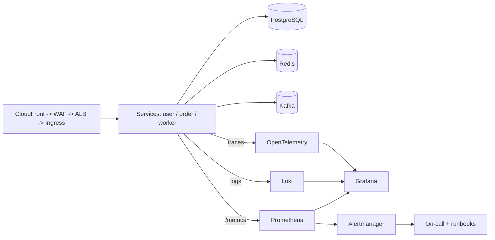
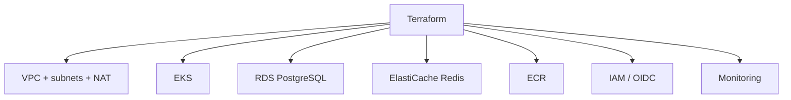

# OpsForge — Architecture

OpsForge is a production-style, cloud-native DevSecOps & SRE platform. A
developer pushes code; the platform tests it, secures it, builds and signs a
container, deploys it via GitOps to Kubernetes, and observes it with full
metrics/logs/traces, SLOs, alerting, and incident tooling.

## Delivery pipeline

```mermaid
flowchart LR
    dev[Developer push] --> ci{{GitHub Actions}}
    ci --> lint[Lint + Unit tests]
    lint --> sast[SAST + dependency scan]
    sast --> build[Docker build]
    build --> scan[Trivy scan]
    scan --> sbom[SBOM - Syft]
    sbom --> sign[Sign - Cosign]
    sign --> ecr[(ECR / GHCR)]
    ecr --> gitops[Update GitOps repo]
    gitops --> argo[Argo CD]
    argo --> k8s[(Kubernetes)]
```

## Runtime & observability

## Infrastructure (Terraform)

See [`../README.md`](../README.md) for the phased roadmap and the status of
each area, and [`adr/`](adr/) for the decisions behind these choices.
